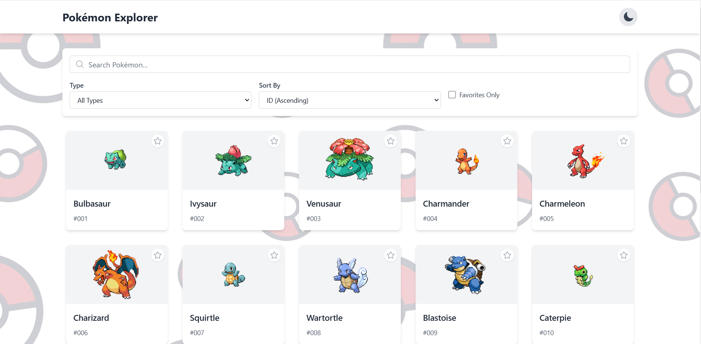
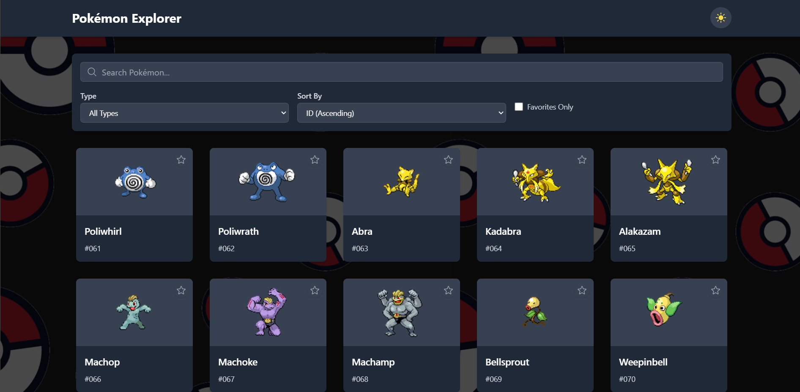

# Pokémon Explorer

A modern React application for exploring Pokémon with advanced filtering, search, and dark mode support.

  

## Features

- 🎨 **Dark/Light Mode** - Theme switching with persistent preferences
- ⭐ **Favorites System** - Save your favorite Pokémon
- 🔍 **Advanced Search** - Real-time search with debouncing
- 🎯 **Smart Filtering** - Filter by type, favorites, and sort options
- 📱 **Responsive Design** - Works on desktop, tablet, and mobile
- 🎪 **Enhanced Pagination** - Smart pagination with page numbers and navigation
- 🖼️ **Theme Backgrounds** - Different backgrounds for light/dark modes

## 🖼️ Entrance UI
  <div align="center">
    
    
  </div>

## Quick Start

### Prerequisites

- Node.js 16+ 
- npm or yarn

### Installation

1. **Clone the repository**
   ```bash
   git clone https://github.com/oddPotatoo/Pokemon-Explorer.git
   cd Pokemon-Explorer
2. **Install Dependencies**
   ```bash
   npm install

# Architecture & Trade-offs

## Tech Stack Choices

- **React 18 + TypeScript**: Type safety and modern React features
- **React Router v6**: Client-side routing with search state preservation
- **TanStack Query v4**: Server state management with caching and background updates
- **Zustand**: Lightweight state management for UI state (theme, favorites)
- **Tailwind CSS**: Utility-first CSS for rapid UI development
- **Heroicons**: Consistent iconography

## Architecture Decisions

### State Management Strategy

- **Zustand for UI state**: Simple and scalable for theme and favorites
- **TanStack Query for server state**: Automatic caching, background updates, and error handling
- **URL Search Params for filter state**: Shareable URLs and browser history support

### Component Structure

- **Smart Pages**: Handle data fetching and state management
- **Dumb Components**: Focus on presentation and user interaction
- **Custom Hooks**: Reusable logic for search, pagination, and filters

### Performance Optimizations

- **Debounced Search**: 400ms delay to prevent excessive API calls
- **Lazy Loading Images**: Better loading performance for Pokémon sprites
- **Virtualized Lists**: Efficient rendering for large datasets

## Trade-offs

### API Limitations

- Using PokeAPI v2 which has rate limiting
- No bulk details endpoint, requiring individual fetches for details
- Compromised on displaying types in list view due to API structure

### Bundle Size

- Added Tailwind CSS (~70KB gzipped) for development velocity
- Additional icons library for consistent UI

### State Complexity

- URL search params for filters adds complexity but enables shareable state
- Multiple state sources (URL, Zustand, TanStack Query) requires careful synchronization

---

# If I Had More Time: Pokémon Abilities Section

## Next Priority: Abilities Detail View

I would implement a comprehensive abilities section with:

### Ability Details Page

- Detailed description and effects
- Pokémon that can have this ability
- Generation introduced and hidden ability status

### Enhanced Ability Display

- Interactive tooltips on hover
- Color-coded by effect type (positive/negative/neutral)
- Comparison between similar abilities

### Ability-based Filtering

- Filter Pokémon by abilities they can have
- Search for Pokémon with specific ability combinations
- Filter by hidden abilities only

## Why Abilities Next?

- **Strategic Value**: Abilities are crucial for competitive Pokémon battling
- **User Engagement**: Deepens the exploration aspect of the app
- **Technical Challenge**: Requires complex data relationships and filtering
- **Completeness**: Makes the app a more comprehensive Pokémon resource
